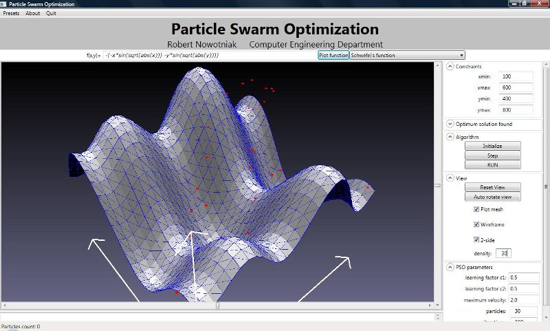

# Particle Swarm Optimization algorithm in VB .NET

Author: Robert Nowotniak, 2009 <<rnowotniak@gmail.com>>

The main algorithm logic is implemented in [PSO.vb](https://github.com/rnowotniak/ParticleSwarmOptimization-vb/blob/master/Optimization/PSO.vb) file.

